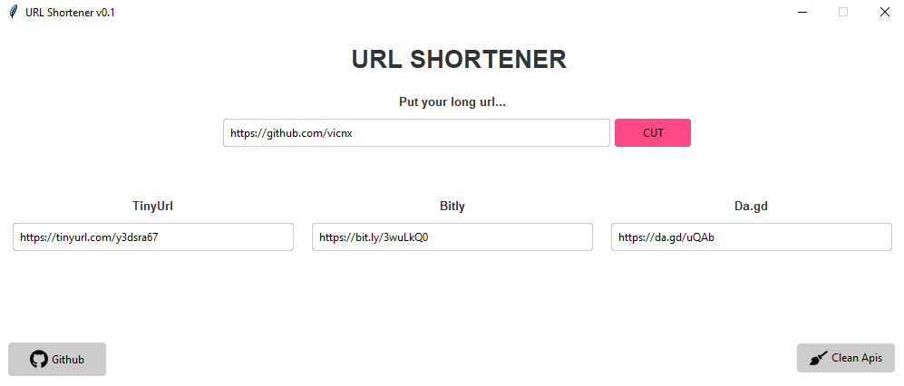

<h1 align="center">Welcome to URL Shortener 👋</h1>
<p>
  
  
</p>

> This application is currently still under development, it may contain errors or bugs.

> This application is designed with Python to practice connecting with third party APIs.
> Its operation is quite simple, you enter a long URL and it gives you several shortened options (depending on the ones you have active) TinyURL is always active.

## Images

### First use


### Aplication



## Install

You need to have [Python](https://www.python.org/downloads/) installed and install the project requirements.

```sh
pip install -r requirements.txt
```

## Usage

```sh
python urlShortener.py
```

## Compile to .exe

To compile the script into an .exe you just have to have [pyinstaller](https://pyinstaller.org/en/stable/) installed.

```sh
pip install -U pyinstaller
```

And just run:

```sh
pyinstaller .\urlShortener.spec
```

## Author

👤 **Vicente**

- Github: [@vicnx](https://github.com/vicnx)

## Show your support

Give a ⭐️ if this project helped you!
